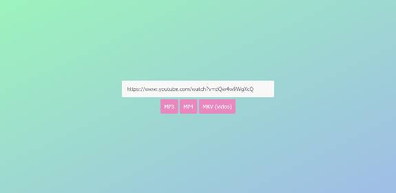

# simple-yt-nodejs-downloader
Simple YouTube downloader based on ytdl &amp; ffmpeg. Do not lose time to write own downloader, just grab it and use it.

It's *half* **REST API** based on **NODE JS EXPRESS**. You need to have **NODEJS** installed on your server/computer.

Just grab repository and execute `npm i`. To run downloader just type `node app.js` or run `start.bat`.

To open downloader type `localhost:3000` or *Your adress IP:PORT* in browser. Downloaded files will appears in folders (mp3,mp4,mkv)
- mp3 - Just downloading audio
- mp4 - Downloading video & music in 360p
- mkv - Downloading video & music in best quality 
